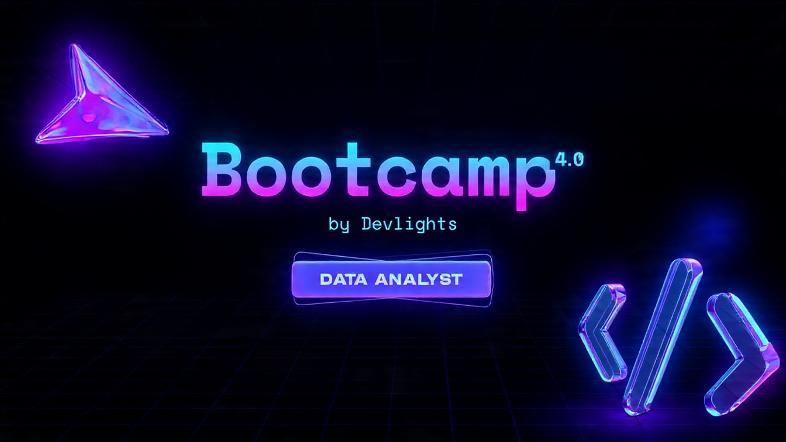
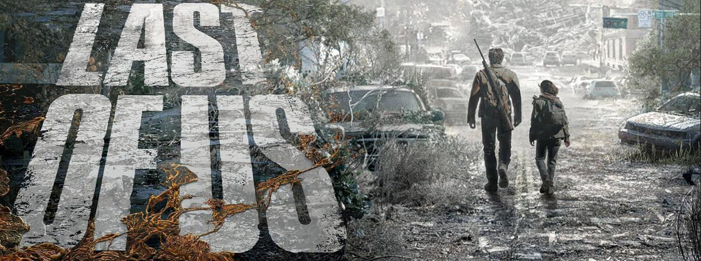

# **BOOTCAMP 4.0 by DEVLIGHTS**

  

## **GRUPO \*LAST OF US\***

  

  - **Integrantes**:
    - **Cecilia Molo.**
    - **Andrés Luna.**

### Trabajo Final Integrador

#### 1. Video Demostración (corto, 5')

 <iframe width="560" height="315" src="https://www.youtube.com/embed/iu9Clq_nupY" title="YouTube video player" frameborder="0" allow="accelerometer; autoplay; clipboard-write; encrypted-media; gyroscope; picture-in-picture; web-share" allowfullscreen></iframe>

#### 2. Datasets
Pueden encontrar los dataset ingresando al siguiente <a href="https://datos.magyp.gob.ar/dataset/arroz-siembra-cosecha-produccion-rendimiento" target="_blank">link</a>.

#### 3. Nuestro Trabajo de limpieza y preparación de los datos en Google Sheet

<iframe src="https://docs.google.com/spreadsheets/d/e/2PACX-1vSIhcz70GRmRvvQKHGVsX3_lc5GtRXbQ94oXWFjHr6FfmuEGUyguAcFx66QP9rpEmTXHtpW6DCqdGhC/pubhtml?widget=true&amp;headers=false" style="width:100%;height:800px"></iframe>

Link a la <a href="https://docs.google.com/spreadsheets/d/1p_Ulh7m4zO5M6wLGBE2jUJyGuVByP752w3gy7-mh_VU/edit?usp=sharing" target="_blank">planilla</a>.

#### 4. Lo que podes encontar en nuestro repo:
- [Documento Docker compose para creación de los conteiners necesarios](./docker-compose.yml)
- [CSV original](./assets/csv/original/arroz-serie-1924-2023.csv)
- [Carpeta csv's con datos normalizados](./assets/csv/)
- [DER BBDD](./assets/DER.png).
- [Carpeta con scripts sql](./scripts_sql/)